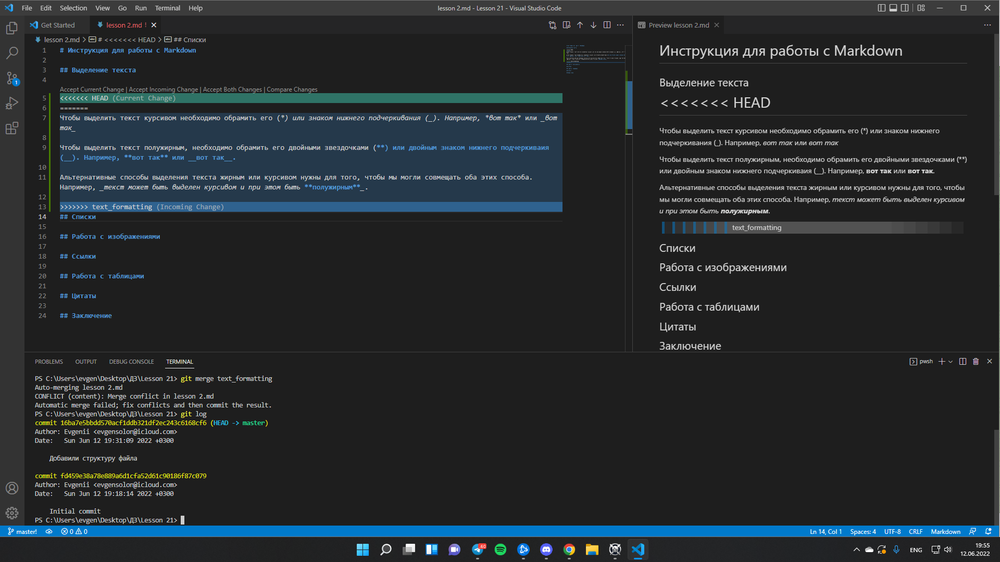
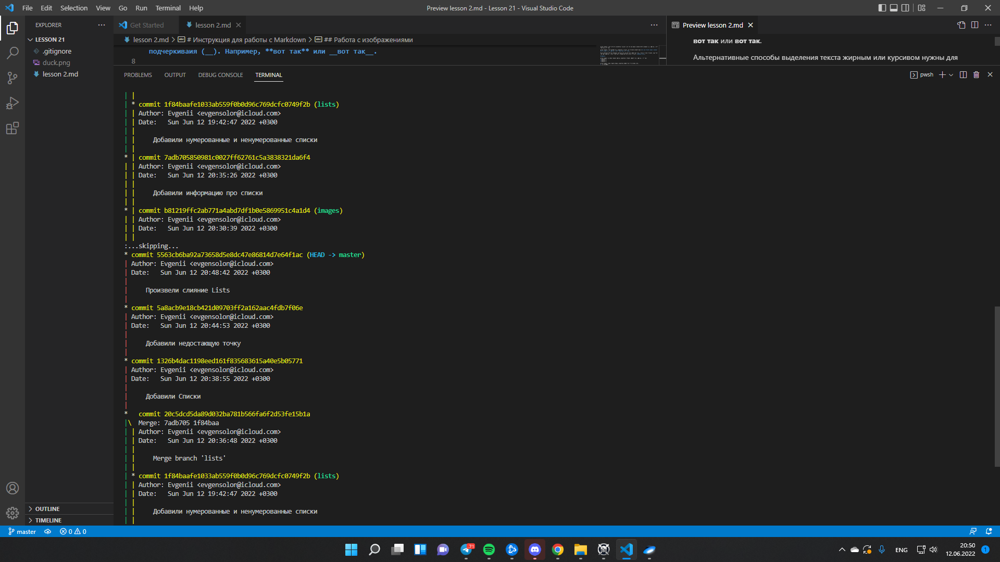

# Инструкция по работе с Git

---

## Начало работы с Git

Для того чтобы начать работу с Git нам необходимо скачать и установить само приложение Git и VS Code(Visual Studio Code). Скачать Git можно по ссылке <https://git-scm.com>, VS Code скачать по ссылке <https://code.visualstudio.com>. 
>Внимательно: не забудьте перезагрузить компьютер после установки данных программ, так они смогут работать более корректно.

Если вы все сделали верно, можете запускать VS Code, ведь Git будет установлен, но искать его не нужно как он запускается, вся ваша работа будет проходить именно в VS Code, а Git просто будет вам в этом помогать. Чтобы он начал вам помогать вам нужно открыть вкладку и **Terminal(Терминал)** в левом верхнем углу и выбрать графу **New Terminal** или же воспользоваться комбинацией клавиш **Ctrl+Shift+`**.

Далее нам необходимо `Представиться` системе контроля версий. Это нужно сделать всего один раз, и Git запомнит вас. Для этого нужно ввести в терминале 2 команды:
>git config --global user.name «Ваше имя англ буквами»
>
>git config --global user.email ваша_почта@example.com

---

## Основные команды **Git**

* **git init** - Команда отвечающая за инициализацию локального репозитория. Первая команда которую нам нужно будет использовать, для того чтобы начать работу с **Git**.
>PS C:\Users\evgen\Desktop\ДЗ\Markdown> git init
* **git status** - Команда позволяет получить информацию от **Git** о его текущем состоянии.
>PS C:\Users\evgen\Desktop\ДЗ\Markdown> git status
>
>On branch master
>
>nothing to commit, working tree clean
* **git add** - Команда позволяет добавить файл или файлы к следующему коммиту. Не забывайте сначала сохранить (Ctrl + S) файл, иначе он **не будет** сохранен и выдаст ошибку. 
>PS C:\Users\evgen\Desktop\ДЗ\Markdown> git add .\Homework.md 
* **git commit -m "message"** - Создание коммита. (*Commit - Комментарий*).
>PS C:\Users\evgen\Desktop\ДЗ\Markdown> git commit -m 'Комментарий к сохранению'
>
>[master 140b36e] Комментарий к сохранению
>
>1 file changed, 17 insertions(+), 1 deletion(-)
* **git log** - Команда вывода на экран истории всех коммитов с их хеш-кодами.
>PS C:\Users\evgen\Desktop\ДЗ\Markdown> git log
>
>commit 140b36e53f7e18afa02a192e77429ff56caf56d1 (HEAD -> master)
>
>Author: Evgenii <evgensolon@icloud.com>
>
>Date:   Sun Jun 12 13:36:56 2022 +0300
>
    Комментарий к сохранению
>
>commit 2fe06a9e86a1b5af3aaa27e2242b7689644042b4
>
>Author: Evgenii <evgensolon@icloud.com>
>
>Date:   Sun Jun 12 13:12:40 2022 +0300

    Возвращаемся к Git

>commit 40d7b676924bd644a6b21e31fafa0289ae02cbb6
>
>Author: Evgenii <evgensolon@icloud.com>
* **git checkout** - Команда для перехода от одного коммита к другому.
>PS C:\Users\evgen\Desktop\ДЗ\Markdown> git checkout
* **git checkout master** - Команда позволяет вернуться к актуальному состоянию и продолжить работу.
>PS C:\Users\evgen\Desktop\ДЗ\Markdown> git checkout master
* **git diff** - Команда позволяет увидеть разницу между текущим файлом и закоммиченным файлом.
>PS C:\Users\evgen\Desktop\ДЗ\Homework Version Control 2> git diff
* **git branch** - Команда позволяет узнать в какой ветке вы находитесь, также посмотреть какие ветки дерева у вас есть.
>PS C:\Users\evgen\Desktop\ДЗ\Homework Version Control 2> git branch 
* **git branch `New_name`** - Команда позволяет добавить новую ветку дерева.
>PS C:\Users\evgen\Desktop\ДЗ\Homework Version Control 2> git branch new_name
* **git merge** - Команда для слияния каких либо веток в ту, в которой вы находитесь в данный момент.
>PS C:\Users\evgen\Desktop\ДЗ\Homework Version Control 2> git merge lists
* **git reset --hard HEAD~1** - Команда которая удаляет последний коммит и возвращает вас на то место где начинался предыдущий коммит.
>PS C:\Users\evgen\Desktop\ДЗ\Homework Version Control 2> git reset --hard HEAD~1
---
## Ошибка Команды MERGE

Ошибка с командой `merge` может произойти в случае слияния двух веток с одинаковыми кодами внутри, когда Git не может слить их автоматически.

Сверху над зеленой строкой **<<<<<<<<<<HEAD** мы видим едва ли заметные 4 надписи, каждая из них дает разный результат сейчас мы разберем их.

1. **Accept Current Change** - Принять текущее изменение, из этого получается, что нажав ее, данные из ветки в которую мы переносим не будут перенесены, и все останется также как есть **в данный момент**. 
2. **Accept Incoming Change** - Принять входящие изменения, из этого получается, что нажав ее, данные перенесутся из той ветки которую мы пытаемся слиять с той в которой в данный момент мы находимся. 
3. **Accept Both Changes** - Принять оба изменения, то есть код которые сейчас находятся в главной ветке останутся, также к ним будет добавлен новый код из ветки которую мы переносим
4. **Compare Changes** - Сравнить изменения. В соседней вкладке появится разница между двумя кодами, такое же сравнение как то которое мы вызываем с помощью команды **>git diff**

---

## Как выглядят ветки дерева Git?

Ветки Git позволяют перемещаться между разными версиями вашего кода. В главной ветке **Master** обычно находится "чистовик", а в остальных ветках именно черновики. Это позволяет сделать работу более комфортной, ведь если что-то не получится в черновике можно переделать. Большую часть написания кода делает не один человек, а команда, будет не очень приятно, когда кто-то сломает уже работающий код. Именно поэтому один из создателей известной ОС Linux Линусу Торвальдсу создал *Git*, для того чтобы сразу некоторое количество программистов могли работать над ядром ОС Linux.Ниже приведен пример как это дерево может выглядеть.

